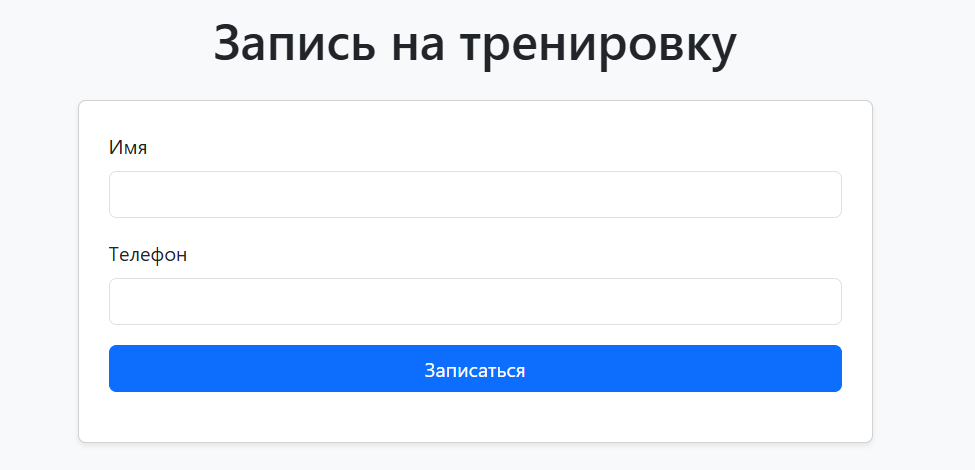

# 🏋️‍♂️ Fitness Booking — онлайн-запись к фитнес-тренеру

Проект для записи клиентов на групповые тренировки через сайт.  
Система учитывает фиксированные слоты и ограниченное количество мест, а тренер получает уведомления в Telegram.

---

## 📸 Интерфейс клиента

Клиент выбирает доступное время, заполняет имя и телефон, и сразу записывается.  
Без регистрации, подтверждений и лишних шагов — просто и быстро.



---

## 📸 Интерфейс тренера (уведомление в Telegram)

После записи тренеру приходит сообщение в Telegram с деталями записи:

- Имя клиента  
- Телефон  
- Дата и время тренировки  


---

## ⚙️ Стек технологий

- **Backend:** ASP.NET Core (C#)
- **ORM:** Entity Framework Core (PostgreSQL)
- **Frontend:** HTML + JavaScript
- **База данных:** PostgreSQL
- **Интеграция:** Telegram Bot API

---

## 📁 Структура проекта

```plaintext
MyApp.Api/
├── Controllers/
│   ├── BookingController.cs
│   └── SlotController.cs
├── Models/
│   ├── Booking.cs
│   └── TrainingSlot.cs
├── Services/
│   └── TelegramNotifier.cs
├── Data/
│   └── FitnessContext.cs
├── Program.cs
├── appsettings.json
└── MyApp.Api.csproj
```
---

## БД 
CREATE TABLE "TrainingSlots" (
    "Id" SERIAL PRIMARY KEY,
    "StartTime" TIMESTAMP NOT NULL,
    "MaxClients" INTEGER NOT NULL
);

CREATE TABLE "Bookings" (
    "Id" SERIAL PRIMARY KEY,
    "Name" TEXT NOT NULL,
    "Phone" TEXT NOT NULL,
    "TrainingSlotId" INTEGER NOT NULL,
    "CreatedAt" TIMESTAMP NOT NULL,
    CONSTRAINT fk_slot FOREIGN KEY ("TrainingSlotId") REFERENCES "TrainingSlots" ("Id") ON DELETE CASCADE
);

